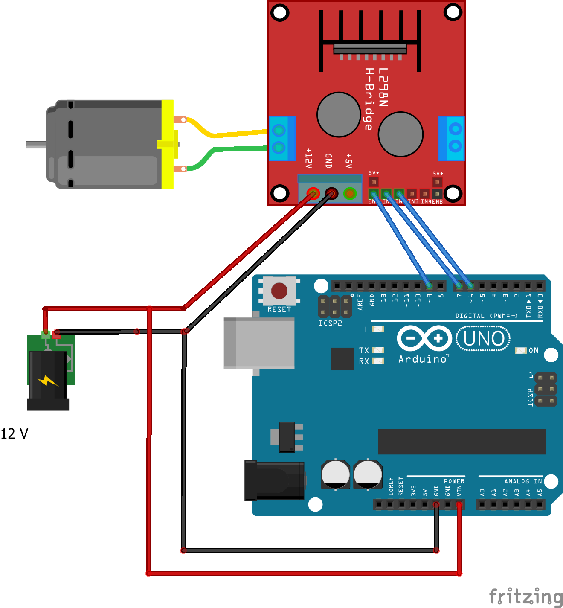
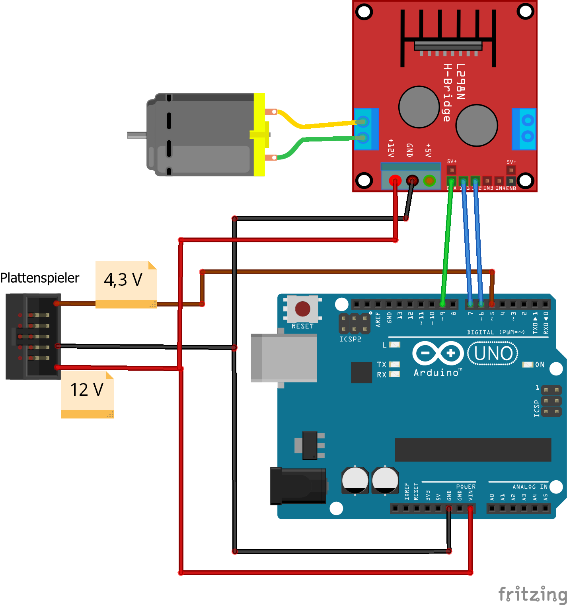
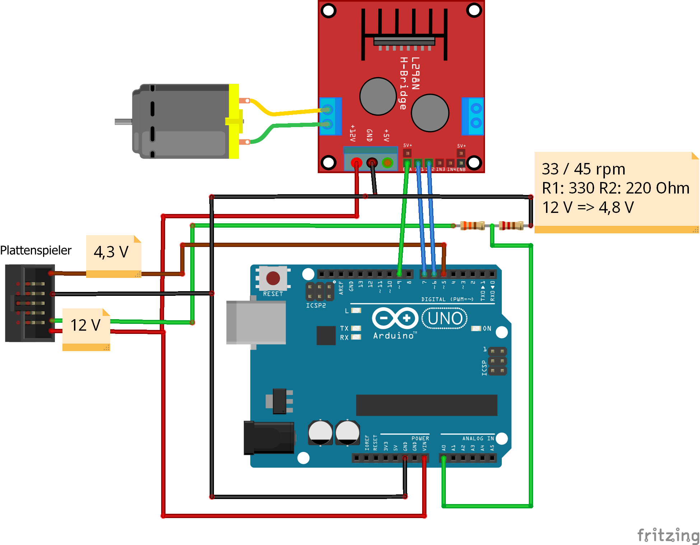
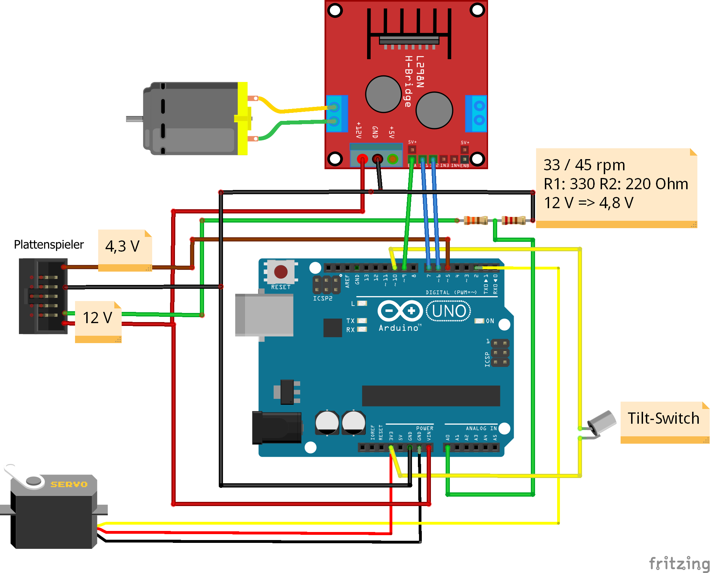

Ausbaustufen:

|#|Beschreibung|Schaltung|
|:-------------:|:-------:|:-------:|
|1|Motor dreht sich||
|2|Einbindung Start/Stop||
|3|Input von 33/45 Rpm||
|4|Auto Tonarm-Steuerung||

https://en.wikipedia.org/wiki/Voltage_divider

